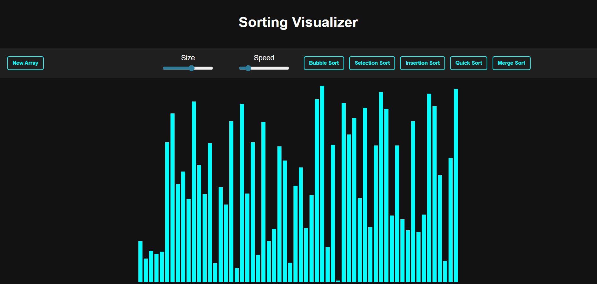

# 🔢 Sorting Visualizer

A simple and interactive web app to visualize popular sorting algorithms using HTML, CSS, and JavaScript.

## 🚀 Features
- Bubble Sort
- Selection Sort
- Insertion Sort
- Merge Sort
- Quick Sort
- Adjustable array size and speed
- New array generator
- Clean UI with bars on top and navbar at bottom

## 📂 Tech Stack
- HTML + CSS + JavaScript

## 🛠 How to Run
1. Clone the repo or download files
2. Open `index.html` in any browser
3. Play with the sorting!

## 📸 Preview
 <!-- Add your own screenshot -->
